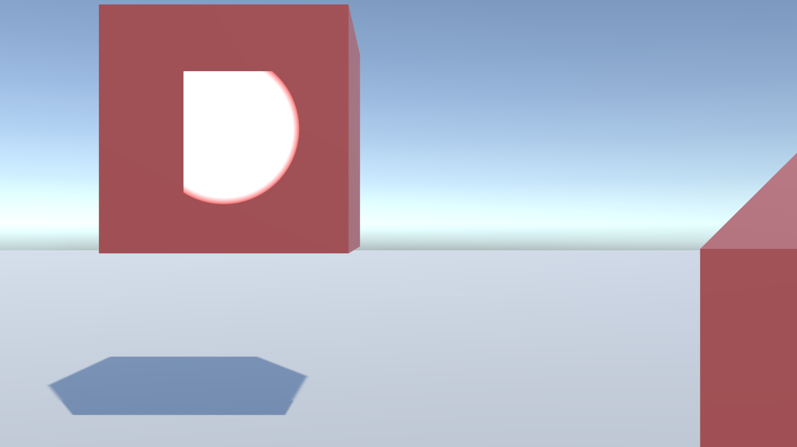
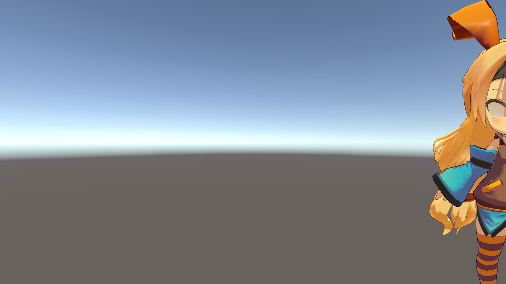

# Custom Perspective の課題
----

# 課題1. ライティング
- 問題：標準のForward Renderingでパースを変形すると、ライトが途中で切れて描画されることがある
- 原因：標準のForward Renderingでは、Point Light と Spot Light で本来のライト描画位置の矩形しかラスタライズされない
- 一時的な解決策：Universal Render Pipelineを使う
    - ただし、全体的なスクリプトの対応が必要
- 根本的な解決案：これらのライトでもラスタライズの範囲を制限しないオプションが欲しい

 
変形なし

 
変形あり

# 課題2. 影
- 問題 パース変形後に画面の端で不自然な影が生じることがある
- 原因 パース変形によりシャドウマップの範囲外の箇所が描画されている
- 一時的な解決策：カメラの画角を広くし、あとから切り抜く
- 根本的な解決案 Directional Light の Shadow Map の画角を広げるオプションが欲しい
    - 全シェーダのShadowCaster書き換えは避けたい
        - CustomPerspective非対応のシェーダまで書き換えないと整合性なくなる
    - 現在は OnPreCull() でCamera.projectionMatrixを設定し、OnPreRender() でCamera.ResetProjectionMatrix() を呼んで対応したが、おそらく想定外の使い方でバッドノウハウ
        - この方法ではPointLightとSpotLightの矩形問題も発生する
- その他：レイトレーシングベースの影を使うと問題が発生しない可能性がある

 
変形なし

 
変形あり（ShadowMap画角そのまま）、右下に影が発生

 
変形あり（一時的な解決策：ShadowMap画角を広く）、ライトが切れる

# 課題3. カリング
- 問題：パース変形後に画面端でオブジェクトが表示されないことがある
- 原因：本来はカリングされるメッシュがパース変形により画面内に入っているが、カリングされたままになっている
- 一時的な解決策：カメラの画角を広くし、あとから切り抜く 
　　　　　　　　各メッシュのバウンディングボックスを予め拡大しておく
- 根本的な解決案：カリングの結果をカメラ毎に手動で設定するオプションが欲しい
    - OnPreCull()でメッシュのバウンディングボックスを変形しても、カリングの結果は変化しなかった
    - CommandBufferで強引に描画してみたが、半透明の整合性がダメそう
 
 
変形なし	 

 
変形あり、ユニティちゃんの目が消える

# 課題4. 接地面の問題
- 問題点：建物など接地する面積が大きいと埋め込みや影ズレが目立つ
- 原因：（埋め込み）パース変形により、地面の方が手前になった。 
　　　（影ズレ）パース変形後も他のモデルや地面へ落ちる影は変わらない
- 一時的な解決策：（埋め込み）レイヤーを分けてレンダリングし、あとから合成 
　　　　　　　　（影ズレ）影ポリゴンを一緒にパース変形させる
- 根本的な解決案：（埋め込み）Mesh Renderer や Skinned Mesh Renderer 毎にステンシルの設定ができるオプションが欲しい
- その他：影ズレについては位置計算の新手法の開発が必要そう

 
変形なし

 
変形あり

※これら4個の課題はUniversal Render Pipelineを改造することでも解決できそうだが、導入の敷居とメンテナンスコストがとても高くなってしまう。
